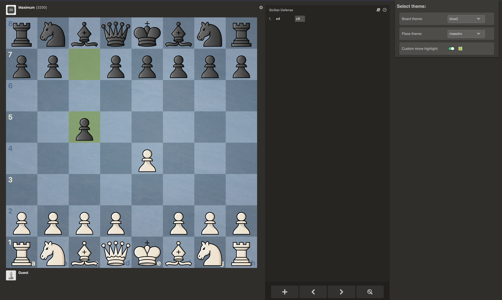

# chessdotcom-expanded-themes
Extra board and piece themes for chessdotcom (chess.com). Includes all lichess themes with plans for additional expansion in the future.



## Building

1. Install dependencies

```bash
$ npm install
```

2. Create the build files
```bash
$ npm run build
```

## Installing the extension

1. Open `chrome://extensions`
2. Toggle developer mode
3. Select the `build` directory created by the previous command

